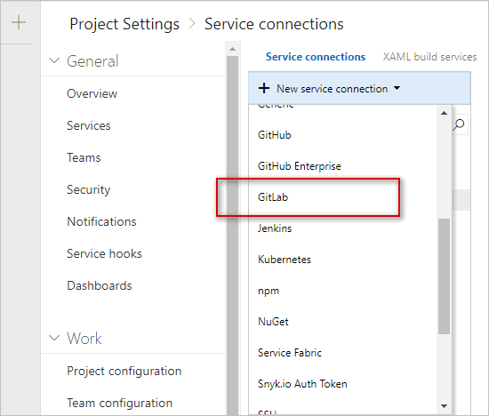
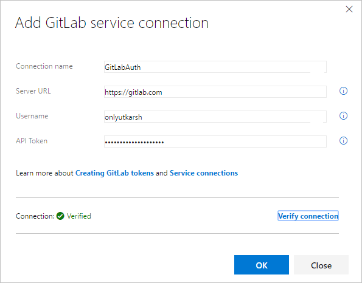
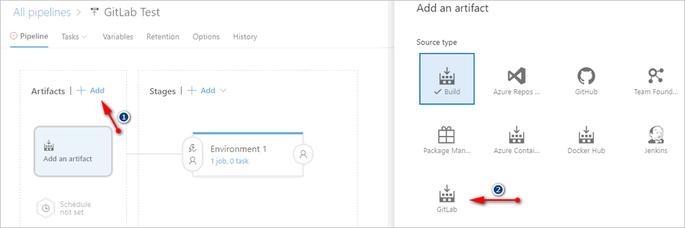
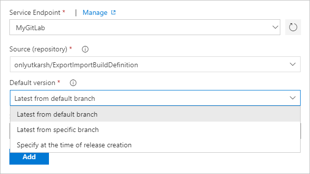
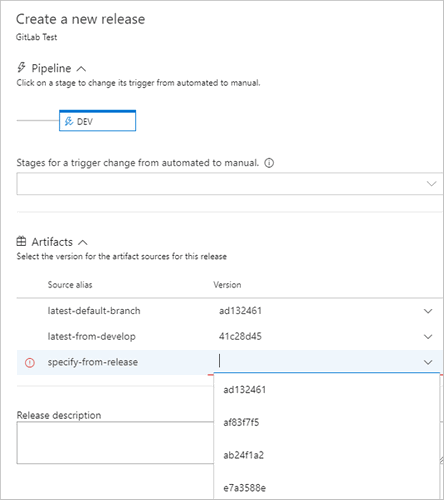
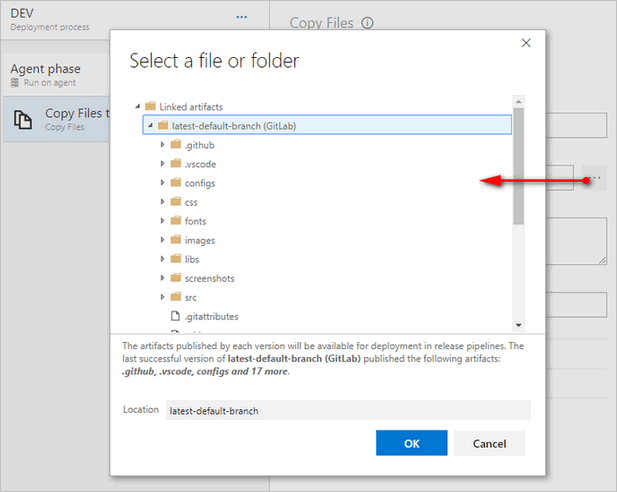
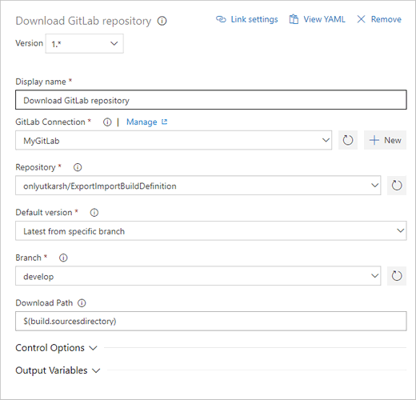

# GitLab Integration for Azure Pipelines

This extension integrates GitLab with Azure Pipelines. With this extension, you will be able to download the sources from a GitLab repository (using `clone` command) and use downloaded sources in Azure Pipelines. The extension comes as an artifact source in `Release Management` and also has a `Build` task to download sources in your build pipeline.

> **3rd Party Notices**
> - *GitLab is the trademark of GitLab, Inc. The GitLab trademark and logo are associated with GitLab - For details go to [GitLab License](https://gitlab.com/gitlab-com/gitlab-artwork/blob/master/README.md) page.*
> - *This extension has been developed by Utkarsh Shigihalli and is not associated with [GitLab](https://gitlab.com/).* 

## Usage

### 1. Connecting to GitLab

The extension provides a GitLab service connection to connect to GitLab using a [Personal access token (PAT)](https://docs.gitlab.com/ee/user/profile/personal_access_tokens.html).

To connect, go to `Project Settings` | `Service connections` tab and create a `New service connection` and click on `GitLab`

You will now see a window asking for GitLab details. Enter your GitLab `UserName` and `API Token`. Give service connection a name and `Verify connection`.

If you verified successfully, click `OK` to save.

### 2. Downloading GitLab repo in Release 

Once you have the GitLab service connection setup, go to `Release` hub in Azure Pipelines and edit a release definition. Click `Add` [1 in image below] on artifacts and select `GitLab` [2 in image below].

You will then need to select the GitLab service connection you created. Once you select, the extension will list all the repositories you own, and after that you will have three options to select artifact `version`.

- `Latest from default branch`: This will download the default branch for the repository.
- `Latest from specific branch`: This will list all the available branches and download the latest commit from the selected branch.
- `Specify at the time of release creation`: As the name suggests, you will have the option to specify the commit id while triggering a release.

Save the release definition and trigger a new release. 

In the dialog which opens, you will see all your linked artifacts. You will have an option to fill in the commit id if you have selected `specify at the time of release creation` for an artifact source.

### 3. Browse artifacts

Once you link your artifact to release, you will also be able to browse the linked artifacts from GitLab in any of the tasks in your pipeline. In the image below, I am browsing artifacts from GitLab inside a `Copy Files` task. Cool right?

### 4. Downloading GitLab repo in Build

In some scenarios, you may also want to consume the GitLab repository in your Azure Pipelines build definition. The extension provides the build task to clone and download the repository. 

In your build definition, search for the task and you should see the task listed.

Click `Add` and select the created GitLab service connection. Once you do that, as you can see from the screenshot, you will be able to select the repository, branch and version. You will have to specify the `Download Path` to which the source from GitLab should be downloaded. In the image below, I am setting it to a Azure DevOps variable `$(build.sourcedirectory)` but you can use any valid path.

## Changes

> - #{Release.ReleaseName}#
>   - Fix [issue 8](https://github.com/onlyutkarsh/gitlab-integration/issues/8) where on-premises URL configured in the endpoint was not considered
>   - Merge [PR #6](https://github.com/onlyutkarsh/gitlab-integration/pull/6)
>   - Other minor fixes
> - 1.0.0
>   - Initial release

## Feedback

Please rate the extension and share/tweet to spread the word!!

- Found a bug or need to make a feature request? - Raise it as an [issue](https://github.com/onlyutkarsh/gitlab-integration/issues).
- Have a question? - Raise it here in the Q and A section.

## Credits

Special thanks to Sriram Balasubramaniam, Omesh Pandita, Romil Goyal, Ashok Kirla and Gopinath Chigakkagari from Microsoft product team, for all the guidance and support in developing this extension.
